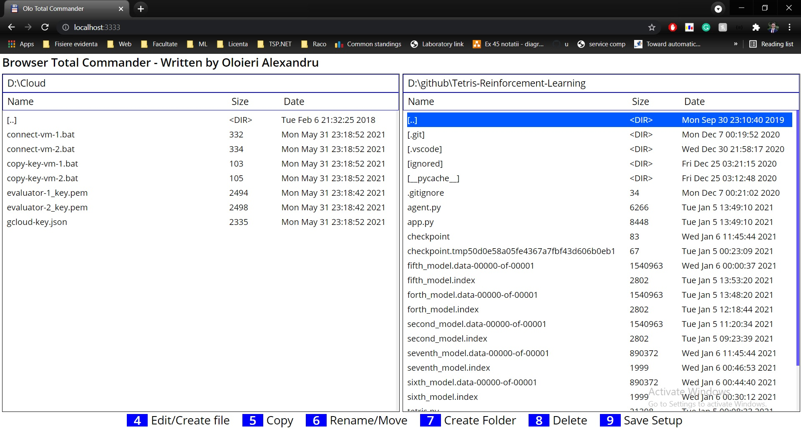

# Browser-Total-Commander

Final Project for University Python Course

## Implemented functionalities

- Open/edit files
- Navigate file system
- Create files/directories
- Delete files/directories
- Copy files/directories
- Move files/directories
- Keyboard shortcuts
- Save state (JWT in local storage)

## Technologies

- Python Flask Server
- Vanilla JS Web App
- JWT
